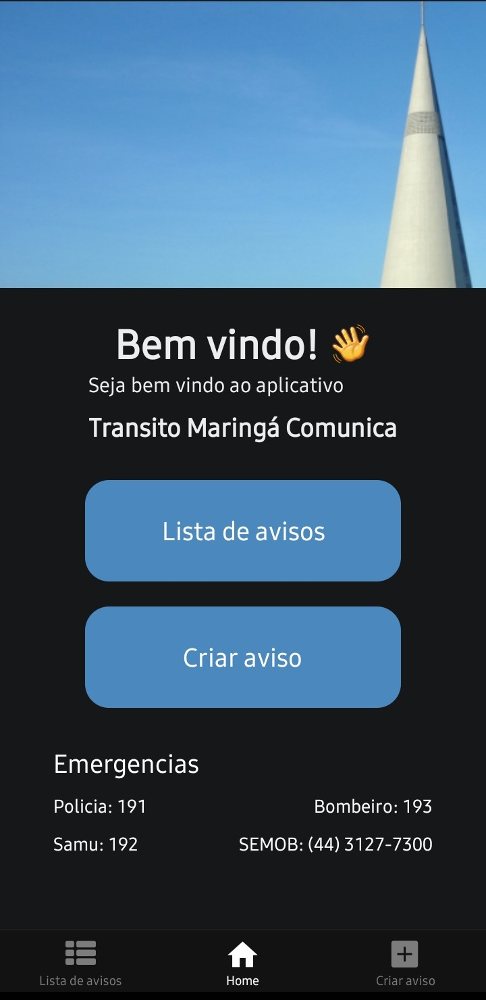
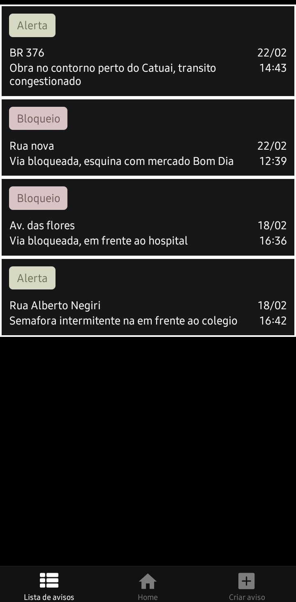
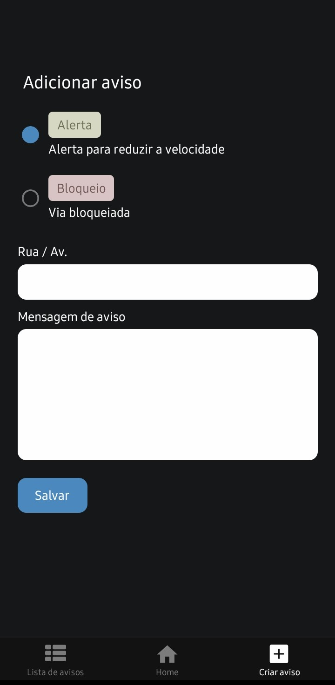

# Bem vindo ao Transito Maringá Comunica 👋

Este aplicativo, tem como objetivo melhorar a comunicação no trânsito, permitindo que motoristas e pedestres sejam alertados sobre vias bloqueadas, interdições e condições de tráfego em tempo real. Com uma interface intuitiva, o app facilita o compartilhamento de informações importantes para garantir um deslocamento mais seguro e eficiente.

## Índice

- [Funcionalidades do projeto](#funcionalidades)
- [Layouts/Demostração](#layout)
- [Tecnologias utilizadas](#tecnologias)
- [Como rodar o projeto](#build)
- [Onde baixar](#site)
- [Pessoas autoras](#dev)

## 🛠️ Funcionalidades do projeto
O aplicativo possui três telas principais, facilitando a comunicação sobre vias bloqueadas ou que exigem atenção especial no trânsito:

### 🏠 Home (Tela Principal)

Opções para criar um aviso e listar avisos ativos.
Exibição de números úteis, como polícia, bombeiros e emergência.

### 📋 Lista de Avisos

Exibe os avisos cadastrados, mostrando:
Rua/Avenida afetada.
Data e horário do aviso.
Mensagem descritiva sobre a situação.
Flag de status, indicando se a via está bloqueada ou apenas requer atenção.
### ✍️ Criar Aviso

Permite cadastrar um novo aviso informando:
Se a via está bloqueada ou apenas requer atenção.
Nome da rua ou avenida afetada.
Uma mensagem com detalhes da situação.

## Layouts/Demostração




## Tecnologias útilizadas
- React Native expo
- Expo-network
- Firebase
- [Figma](https://www.figma.com/community/file/1477336449935606570)
- [Fluxograma](https://raw.githubusercontent.com/Diego0liver/Transito-Maringa-Comunica/refs/heads/main/assets/images/fluxograma.jpg)

## Como rodar o projeto
1. Install dependencies

   ```bash
   npm install
   ```

2. Configurar firebase

   ```bash
   Renomei o arquivo firebaseConfigExemplo para firebaseConfig.
   Coloque as credencias do firebase.
   ```

2. Start the app

   ```bash
    npx expo start --clear
   ```


## Onde baixar
Criei esse site com o link do APK para facilitar as pessoas a baixar o APP. <br/>
[www.maringacomunica.vercel.app](https://site-maringa-comunica.vercel.app/)

## Pessoas autoras
Este aplicativo foi desenvolvido por mim, com o apoio da população de Maringá. Durante uma palestra sobre trânsito, foram coletadas sugestões e insights valiosos para aprimorar a comunicação e a segurança nas vias da cidade. 
